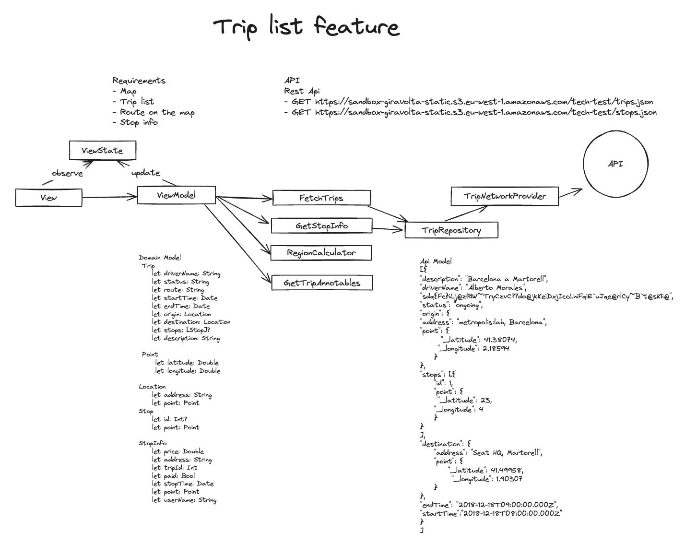
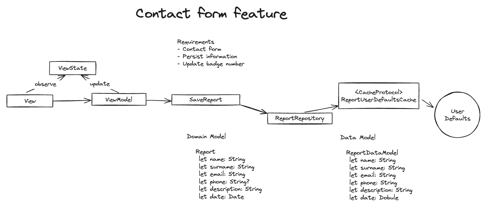

# TestCode

## 1. System Design

Creating a diagram can help us to think deeply in the solution.

**Trip list System Design**

**Contact form System Design**

## 2. Setup Project and Git

- **Create Xcode Project**: Set up the initial Xcode project to begin development.
- **Setup Git**: Initialize a Git repository and set up branches for feature development.
- **Create Main Folders**: Structure the project with main folders to organize the codebase.

## 3. Development

The development process was iterative and test-driven:

- **ViewModel and Tests**: Started with the ViewModel and its unit tests to define the core functionality. This included creating mocks to simulate the business logic and data layer behavior.
- **Business Logic and Data Layer**: Developed all the business logic and data layer with unit tests for each class.
- **View Development**: With the logic in place, focused on constructing the views based on the `uiModel` provided by the ViewModel.
- **Dependency Injection**: Utilized the DIP package to manage dependencies throughout the app, which allowed for better modularity and testability.
- **SwiftUI over UIKit**: Using SwiftUI over UIKit UIWindow allows you to use coordinators with UIKit and SwiftUI, what facilitates navigation, and also migration between frameworks.

## 5. Things I could have done

- **Error Handling**: Current error handling is basic, displaying only generic errors. This could be improved to provide more detailed feedback to the user.
- **Feature Flags**: Incorporation of feature flags would allow for more flexible release management and A/B testing.
- **Design improvements** Due to time constraints, the implementation of the design has been simplified."
